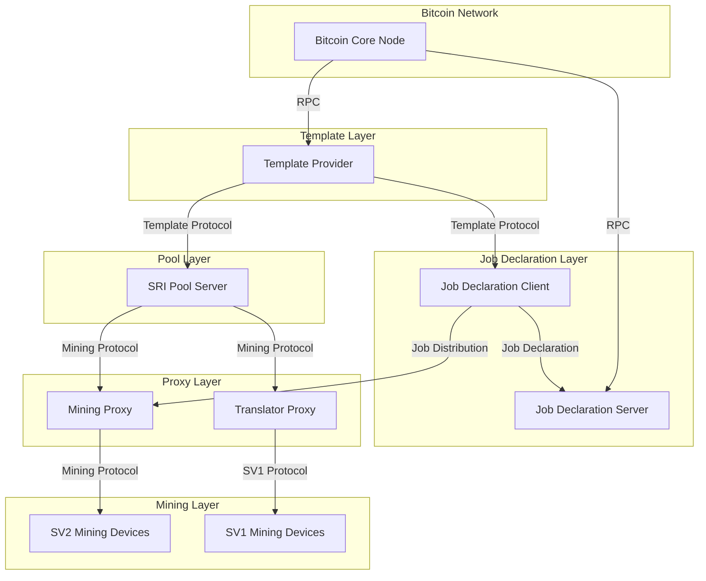
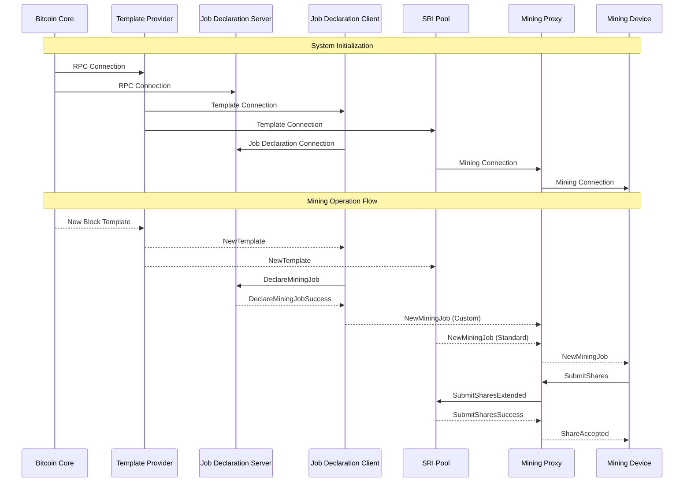
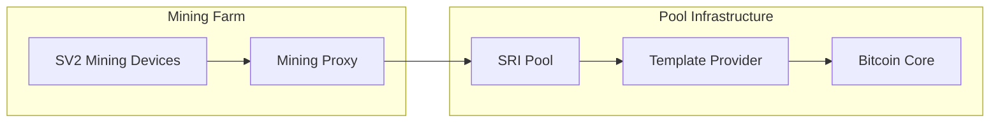
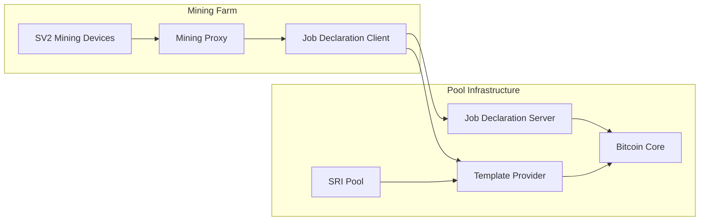
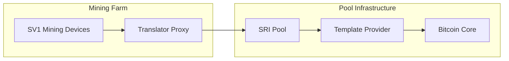

# Stratum V2 Reference Implementation - Roles Overview

This document provides a comprehensive overview of all roles in the Stratum V2 Reference Implementation (SRI) and their interactions within the mining ecosystem.

## Role Architecture Overview

## Roles Summary

| Role | Purpose | Upstream Protocol | Downstream Protocol | Default Port |
|------|---------|------------------|-------------------|--------------|
| **Job Declaration Server** | Manages job declarations, mempool, and block submission | Bitcoin Core RPC | Job Declaration Protocol | 34264 |
| **Job Declaration Client** | Declares custom jobs and distributes work | Template + Job Declaration | Job Distribution Protocol | Configurable |
| **SRI Pool** | Central mining coordination | Template Distribution | Mining Protocol | Configurable |
| **Mining Proxy** | Mining device aggregation | Mining Protocol | Mining Protocol | Configurable |
| **Translator Proxy** | SV1 to SV2 protocol bridge | Mining Protocol | Stratum V1 | Configurable |

## Individual Role Descriptions

### Job Declaration Server (JDS)
The Job Declaration Server is a critical component that manages job declarations from Job Declaration Clients and maintains a local mempool synchronized with Bitcoin Core. It serves as the bridge between custom mining operations and the Bitcoin network.

**Key Responsibilities:**
- **Job Declaration Management**: Validates and processes job declarations from JDCs
- **Mempool Synchronization**: Maintains a local cache of Bitcoin transactions via RPC calls
- **Block Submission**: Forwards valid blocks to Bitcoin Core using `submitblock` RPC
- **Protocol Handling**: Implements the Job Declaration Protocol for secure communication

**Network Configuration:**
- **Downstream Port**: 34264 (Job Declaration Protocol)
- **Upstream**: Bitcoin Core RPC (port 8332/48332)
- **Encryption**: Noise Protocol for JDC connections, optional TLS for RPC

### Job Declaration Client (JDC)
The Job Declaration Client enables miners to use custom block templates while participating in mining pools. It acts as an intermediary between Template Providers, Job Declaration Servers, and downstream mining infrastructure.

**Key Responsibilities:**
- **Template Management**: Receives and processes custom block templates from Template Providers
- **Job Declaration**: Declares template usage with Job Declaration Servers
- **Job Distribution**: Distributes mining jobs to downstream Mining Proxies
- **Channel Relay**: Transparently relays extended channel requests to upstream services

**Network Configuration:**
- **Upstream**: Template Provider (Template Distribution Protocol), JDS (Job Declaration Protocol)
- **Downstream**: Mining Proxies (Job Distribution Protocol)
- **Encryption**: Noise Protocol for all SV2 connections

### SRI Pool
The SRI Pool serves as the central mining coordination point, managing mining jobs, processing share submissions, and coordinating with Template Providers for efficient mining operations.

**Key Responsibilities:**
- **Job Management**: Creates and distributes mining jobs from templates
- **Share Processing**: Validates and processes share submissions from miners
- **Channel Management**: Handles both standard and extended mining channels
- **Payout Management**: Manages coinbase outputs and reward distribution

**Network Configuration:**
- **Upstream**: Template Provider (Template Distribution Protocol)
- **Downstream**: Mining Proxies, Translator Proxies (Mining Protocol)
- **Encryption**: Noise Protocol for all client connections

### Mining Proxy
The Mining Proxy aggregates multiple mining devices and provides intelligent upstream connection management with support for different channel types and operational modes.

**Key Responsibilities:**
- **Device Aggregation**: Manages connections from multiple mining devices
- **Channel Management**: Supports Group, Extended, and ExtendedWithDeclarator modes
- **Protocol Translation**: Converts between standard and extended channel protocols
- **Load Balancing**: Distributes work efficiently across connected devices

**Network Configuration:**
- **Upstream**: SRI Pool, JDC (depending on mode)
- **Downstream**: Mining devices (Mining Protocol)
- **Encryption**: Noise Protocol for all SV2 connections

### Translator Proxy
The Translator Proxy provides backward compatibility by bridging Stratum V1 mining devices with Stratum V2 infrastructure, enabling gradual migration to SV2.

**Key Responsibilities:**
- **Protocol Translation**: Converts between Stratum V1 and V2 protocols
- **Legacy Support**: Enables existing SV1 hardware to work with SV2 pools
- **Message Mapping**: Translates message types and formats between protocol versions
- **Authentication Bridge**: Handles different authentication mechanisms

**Network Configuration:**
- **Upstream**: SRI Pool (Mining Protocol SV2)
- **Downstream**: SV1 Mining devices (Stratum V1 Protocol)
- **Encryption**: Noise Protocol upstream, plain TCP downstream

### Template Provider
The Template Provider connects to Bitcoin Core and distributes block templates to pools and Job Declaration Clients, serving as the source of mining work.

**Key Responsibilities:**
- **Template Generation**: Creates block templates from Bitcoin Core
- **Template Distribution**: Distributes templates to pools and JDCs
- **Chain Monitoring**: Monitors blockchain for new blocks and updates
- **Transaction Management**: Provides transaction data for template construction

**Network Configuration:**
- **Upstream**: Bitcoin Core RPC (port 8332/48332)
- **Downstream**: SRI Pool, JDC (Template Distribution Protocol)
- **Encryption**: Optional Noise Protocol for template distribution

## Detailed Role Interactions

### Complete Mining Stack Flow

## Network Topology Configurations

### Configuration 1: Standard Pool Mining

### Configuration 2: Job Declaration Mining

### Configuration 3: Legacy SV1 Integration

## Protocol Matrix

| Source Role | Target Role | Protocol | Port | Encryption | Authentication |
|-------------|-------------|----------|------|------------|----------------|
| JDC | JDS | Job Declaration | 34264 | Noise | Public Key |
| JDC | TP | Template Distribution | Variable | Optional | Optional |
| Pool | TP | Template Distribution | Variable | Optional | Optional |
| MP | Pool | Mining Protocol | Variable | Noise | Public Key |
| MP | JDC | Job Distribution | Variable | Noise | Public Key |
| Trans | Pool | Mining Protocol | Variable | Noise | Public Key |
| SV1 Devices | Trans | Stratum V1 | Variable | None | Basic Auth |
| SV2 Devices | MP | Mining Protocol | Variable | Noise | Public Key |
| JDS | Bitcoin Core | JSON-RPC | 8332/48332 | Optional | Basic Auth |
| TP | Bitcoin Core | JSON-RPC | 8332/48332 | Optional | Basic Auth |

## Message Types by Protocol

### Job Declaration Protocol
- `DeclareMiningJob`: Declare intention to mine on custom template
- `DeclareMiningJobSuccess`: Confirmation of job declaration
- `DeclareMiningJobError`: Job declaration failure

### Template Distribution Protocol
- `NewTemplate`: New block template distribution
- `SetNewPrevHash`: Previous block hash update
- `RequestTransactionData`: Request transaction details

### Job Distribution Protocol
- `NewMiningJob`: Distribute new mining job
- `SetNewPrevHash`: Update job parameters

### Mining Protocol
- `OpenStandardMiningChannel`: Standard channel establishment
- `OpenExtendedMiningChannel`: Extended channel establishment
- `SubmitSharesStandard`: Standard share submission
- `SubmitSharesExtended`: Extended share submission
- `NewMiningJob`: Job distribution
- `SetTarget`: Difficulty target update

### Stratum V1 Protocol
- `mining.subscribe`: Subscribe to mining notifications
- `mining.authorize`: Worker authorization
- `mining.notify`: Job notification
- `mining.submit`: Share submission
- `mining.set_difficulty`: Difficulty update

## Deployment Scenarios

### Scenario 1: Small Mining Operation
**Components**: SV1 Devices → Translator Proxy → SRI Pool
- **Pros**: Simple setup, works with existing hardware
- **Cons**: Limited SV2 features, no custom job selection

### Scenario 2: Medium Mining Farm
**Components**: SV2 Devices → Mining Proxy → SRI Pool
- **Pros**: Full SV2 benefits, efficient operation
- **Cons**: Requires SV2-compatible hardware

### Scenario 3: Advanced Mining with Job Declaration
**Components**: SV2 Devices → Mining Proxy → JDC → JDS + SRI Pool
- **Pros**: Maximum decentralization, custom transaction selection
- **Cons**: Complex setup, requires multiple components

### Scenario 4: Hybrid Environment
**Components**: Mixed SV1/SV2 devices through respective proxies
- **Pros**: Gradual migration path, supports mixed hardware
- **Cons**: Increased complexity, multiple proxy management

## Security Considerations

### Encryption and Authentication
- **Noise Protocol**: Used for all SV2 connections
- **Public Key Authentication**: Secure role identification
- **Certificate Management**: Proper key distribution and validation

### Network Security
- **Firewall Configuration**: Proper port management
- **Connection Limits**: DoS protection mechanisms
- **Input Validation**: Comprehensive message validation

## Performance Optimization

### Connection Management
- **Connection Pooling**: Efficient resource utilization
- **Asynchronous I/O**: Non-blocking operations
- **Load Balancing**: Distribution across multiple instances

### Resource Optimization
- **Memory Management**: Efficient buffer handling
- **CPU Utilization**: Optimized protocol processing
- **Network Bandwidth**: Minimized protocol overhead

## Monitoring and Observability

### Key Metrics
- **Connection Status**: Real-time connection health
- **Protocol Performance**: Message processing rates
- **Error Rates**: Protocol and network error tracking
- **Resource Utilization**: CPU, memory, and network usage

### Logging Strategy
- **Structured Logging**: Consistent log format across roles
- **Log Levels**: Appropriate verbosity for different scenarios
- **Centralized Logging**: Aggregated log collection and analysis

## Troubleshooting Guide

### Common Issues
1. **Connection Failures**: Network connectivity, firewall, authentication
2. **Protocol Errors**: Version mismatches, malformed messages
3. **Performance Issues**: Resource constraints, network latency
4. **Configuration Problems**: Invalid settings, missing parameters

### Diagnostic Tools
- **Connection Testing**: Network connectivity verification
- **Protocol Analysis**: Message flow inspection
- **Performance Profiling**: Resource usage analysis
- **Log Analysis**: Error pattern identification

## Future Enhancements

### Planned Improvements
- **Enhanced Monitoring**: Real-time dashboards and alerting
- **Dynamic Configuration**: Hot-reload of configuration changes
- **Advanced Load Balancing**: Intelligent traffic distribution
- **Multi-Pool Support**: Connection to multiple upstream pools

### Research Areas
- **Protocol Optimizations**: Further efficiency improvements
- **Security Enhancements**: Advanced threat protection
- **Scalability Improvements**: Support for larger deployments
- **Integration Capabilities**: Enhanced ecosystem compatibility

## Getting Started

### Quick Start Guide
1. **Choose Configuration**: Select appropriate deployment scenario
2. **Install Dependencies**: Rust toolchain and system requirements
3. **Configure Roles**: Set up configuration files for each role
4. **Deploy Components**: Start roles in correct dependency order
5. **Monitor Operations**: Verify proper functioning and performance

### Development Setup
1. **Clone Repository**: Get the latest SRI codebase
2. **Build Components**: Compile all required roles
3. **Configure Testing**: Set up test configurations
4. **Run Integration Tests**: Verify component interactions
5. **Start Development**: Begin customization or contribution

For detailed setup instructions for each role, refer to their individual README files in their respective directories.