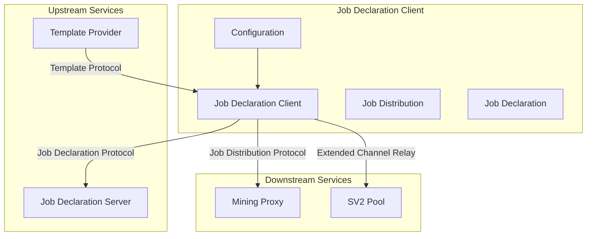
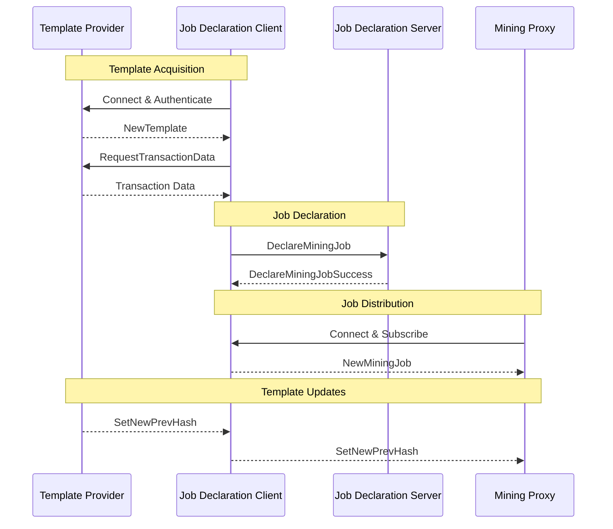
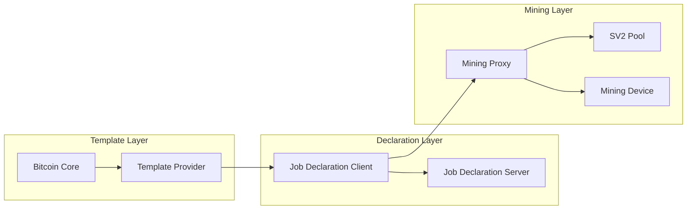
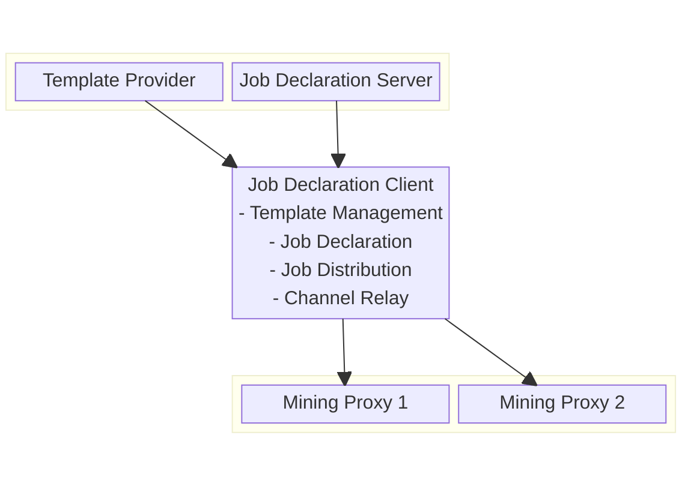

# Job Declaration Client (JDC)

The Job Declaration Client (JDC) is a key component in the Stratum V2 ecosystem that enables miners to use custom block templates while participating in mining pools. It acts as an intermediary between Template Providers, Job Declaration Servers, and downstream mining infrastructure.

## Overview

The JDC receives custom block templates from a Template Provider and declares the use of these templates with mining pools using the Job Declaration Protocol. It then distributes mining jobs to Mining Proxies using the Job Distribution Protocol, enabling miners to have greater control over transaction selection while still participating in pool mining.

## Architecture



## Features

- **Template Management**: Receives and processes custom block templates
- **Job Declaration**: Declares template usage with Job Declaration Servers
- **Job Distribution**: Distributes mining jobs to downstream miners
- **Channel Relay**: Transparently relays `OpenExtendedChannel` requests to upstream
- **Multi-Protocol Support**: Handles Template, Job Declaration, and Job Distribution protocols
- **Fault Tolerance**: Configurable retry mechanisms for connection failures

## Network Protocols and Ports

### Upstream Connections (JDC as Client)

#### Template Provider Connection
- **Protocol**: Stratum V2 Template Distribution Protocol
- **Default Port**: Configurable via `tp_address`
- **Connection Type**: TCP with optional Noise Protocol encryption
- **Message Types**:
  - `RequestTransactionData`: Requests transaction information
  - `NewTemplate`: Receives new block templates
  - `SetNewPrevHash`: Updates previous block hash

#### Job Declaration Server Connection
- **Protocol**: Stratum V2 Job Declaration Protocol
- **Default Port**: 34264 (configurable)
- **Connection Type**: TCP with Noise Protocol encryption
- **Message Types**:
  - `DeclareMiningJob`: Declares intention to mine on template
  - `DeclareMiningJobSuccess`: Receives confirmation
  - `DeclareMiningJobError`: Handles declaration errors

### Downstream Connections (JDC as Server)
- **Protocol**: Stratum V2 Job Distribution Protocol
- **Default Port**: Configurable via `downstream_port`
- **Connection Type**: TCP with Noise Protocol encryption
- **Message Types**:
  - `NewMiningJob`: Distributes new mining jobs
  - `SetNewPrevHash`: Updates mining job parameters

## Message Flow



## Configuration

The JDC is configured via TOML files with the following key sections:

### Downstream Configuration
- `downstream_address`: IP address for downstream connections
- `downstream_port`: Port for downstream mining proxy connections
- `authority_public_key`: JDC's public key for authentication
- `authority_secret_key`: JDC's private key for authentication

### Protocol Versions
- `max_supported_version`: Maximum Stratum V2 version supported
- `min_supported_version`: Minimum Stratum V2 version supported
- `min_extranonce2_size`: Minimum extranonce2 size requirement

### Template Provider Configuration
- `tp_address`: Template Provider connection address
- `tp_authority_public_key`: TP's public key for verification (optional)

### Reliability Settings
- `retry`: Number of reconnection attempts after failures

## Setup and Usage

### Prerequisites
- Access to a Template Provider
- Access to a Job Declaration Server
- Rust toolchain (see project MSRV requirements)

### Configuration Files
Two example configurations are provided:
- `jdc-config-hosted-example.toml`: Uses community-hosted services
- `jdc-config-local-example.toml`: Uses local/self-hosted services

### Running the JDC

```bash
cd roles/jd-client/config-examples/
cargo run -- -c jdc-config-hosted-example.toml
```

### Template Provider Authentication
To verify Template Provider authenticity, obtain the TP's public key from its logs:
```
2024-02-13T14:59:24Z Template Provider authority key: EguTM8URcZDQVeEBsM4B5vg9weqEUnufA8pm85fG4bZd
```

## Role Interactions



### Upstream Dependencies
- **Template Provider**: Required for custom block templates
  - **Protocol**: Template Distribution Protocol
  - **Authentication**: Optional public key verification
- **Job Declaration Server**: Required for job declaration
  - **Protocol**: Job Declaration Protocol
  - **Authentication**: Noise Protocol with key exchange

### Downstream Clients
- **Mining Proxies**: Receive distributed mining jobs
  - **Protocol**: Job Distribution Protocol
  - **Features**: Extended channel relay support

## Block Diagram



## Error Handling and Fault Tolerance

- **Connection Failures**: Automatic retry with configurable attempts
- **Protocol Errors**: Graceful handling of malformed messages
- **Template Validation**: Ensures template integrity before distribution
- **Graceful Degradation**: Continues operation when possible during partial failures

## Security Considerations

- **Noise Protocol**: All connections use Noise Protocol encryption
- **Key Authentication**: Public/private key pairs for secure authentication
- **Template Verification**: Optional Template Provider authentication
- **Input Validation**: Comprehensive validation of all protocol messages

## Monitoring and Logging

- **Structured Logging**: Detailed logging of all protocol interactions
- **Connection Status**: Real-time monitoring of upstream/downstream connections
- **Performance Metrics**: Job distribution and template processing statistics

## Development

### Key Components
- **Template Handler**: Manages Template Provider communication
- **Job Declarator**: Handles Job Declaration Protocol
- **Job Distributor**: Manages downstream job distribution
- **Channel Relay**: Transparently forwards extended channel requests

## Limitations

- Single Template Provider connection
- Limited to Stratum V2 protocol versions
- Requires stable network connectivity for optimal operation

## Future Enhancements

- Multiple Template Provider support
- Enhanced fault tolerance mechanisms
- Real-time performance monitoring
- Advanced job scheduling algorithms
