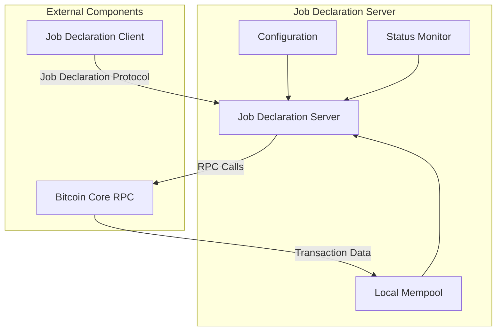
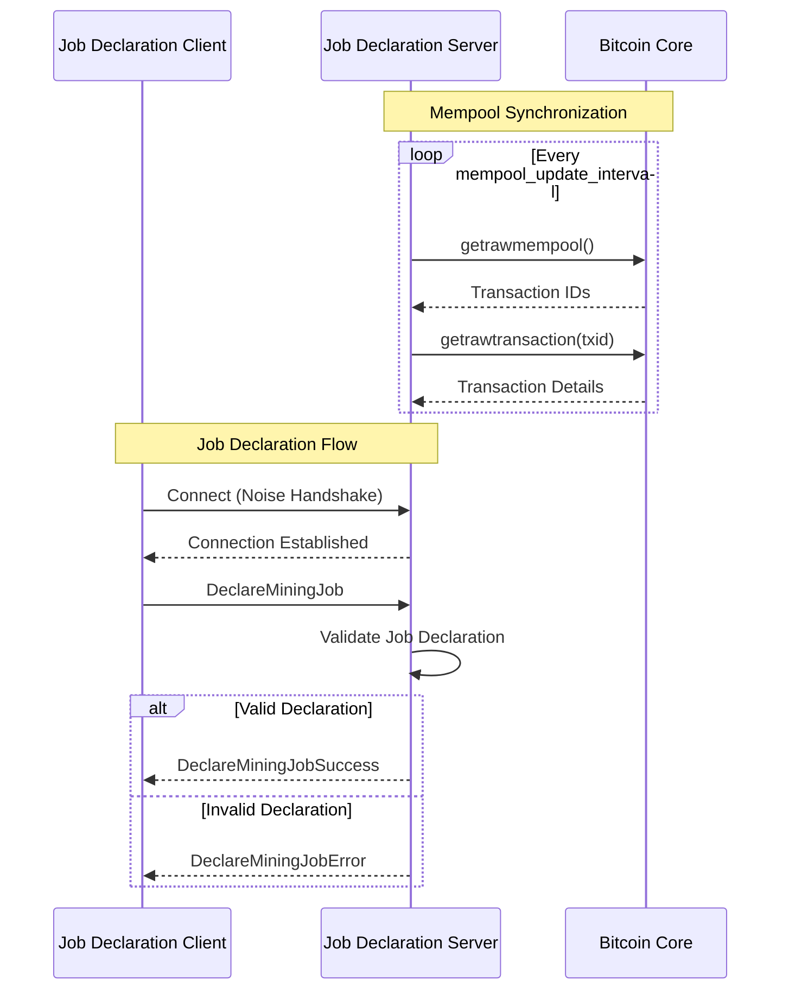
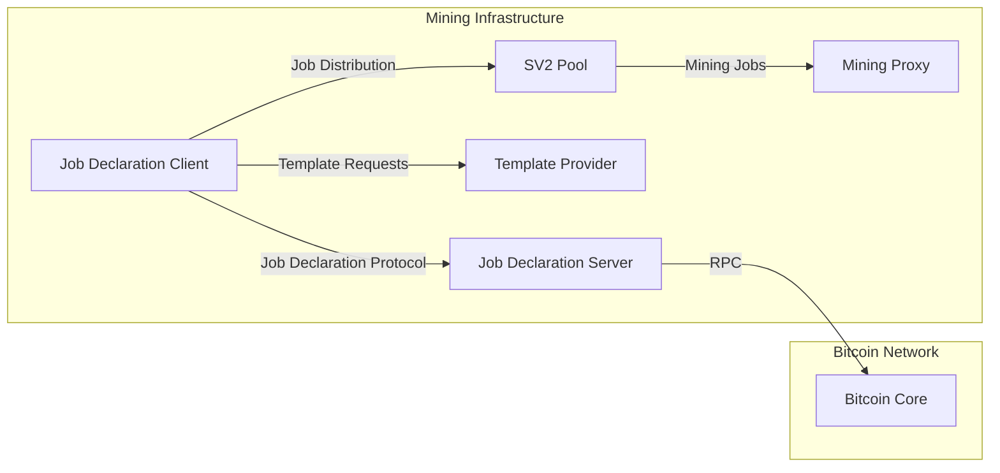

# Job Declaration Server (JDS)

The Job Declaration Server (JDS) is a critical component in the Stratum V2 ecosystem that manages job declarations from Job Declaration Clients (JDCs). It maintains a local mempool synchronized with a Bitcoin Core node and handles the Job Declaration Protocol to coordinate custom block template usage between mining entities.

## Overview

The JDS serves as an intermediary between Job Declaration Clients and the broader mining infrastructure. It validates and processes job declarations, ensuring that custom block templates are properly coordinated and that mining operations can proceed with enhanced flexibility and decentralization.

## Architecture



## Features

- **Job Declaration Protocol**: Handles incoming job declarations from JDCs
- **Mempool Management**: Maintains a synchronized local cache of Bitcoin transactions
- **RPC Integration**: Connects to Bitcoin Core for transaction data
- **Async Runtime**: Built on Tokio for high-performance async operations
- **Health Monitoring**: Includes status monitoring and error propagation
- **Configurable**: Flexible configuration via TOML files

## Network Protocols and Ports

### Downstream Connections (JDS as Server)
- **Protocol**: Stratum V2 Job Declaration Protocol
- **Default Port**: 34264 (configurable via `listen_jd_address`)
- **Connection Type**: TCP with Noise Protocol encryption
- **Message Types**:
  - `DeclareMiningJob`: Declares intention to mine on a specific job
  - `DeclareMiningJobSuccess`: Confirms successful job declaration
  - `DeclareMiningJobError`: Reports job declaration errors

### Upstream Connections (JDS as Client)
- **Protocol**: Bitcoin Core RPC (JSON-RPC over HTTP)
- **Default Port**: 48332 (configurable via `core_rpc_port`)
- **Connection Type**: HTTP/HTTPS
- **RPC Methods Used**:
  - `getrawmempool`: Retrieves current mempool transactions
  - `getrawtransaction`: Gets detailed transaction information

## Message Flow



## Configuration

The JDS is configured via TOML files. Key configuration sections include:

### Core Settings
- `full_template_mode_required`: Whether JDC must reveal transactions
- `authority_public_key`: Server's public key for authentication
- `authority_secret_key`: Server's private key for authentication
- `cert_validity_sec`: Certificate validity duration

### Network Configuration
- `listen_jd_address`: Address and port for JDC connections
- `core_rpc_url`: Bitcoin Core RPC URL
- `core_rpc_port`: Bitcoin Core RPC port
- `core_rpc_user`: RPC username
- `core_rpc_pass`: RPC password

### Coinbase Configuration
- `coinbase_outputs`: List of outputs for coinbase transactions
- Supports multiple output types: P2PK, P2PKH, P2WPKH, P2SH, P2WSH, P2TR

### Mempool Settings
- `mempool_update_interval`: Frequency of mempool synchronization

## Setup and Usage

### Prerequisites
- Bitcoin Core node with RPC enabled
- Rust toolchain (see project MSRV requirements)

### Configuration Files
Two example configurations are provided:
- `jds-config-local-example.toml`: Local development setup
- `jds-config-hosted-example.toml`: Production/hosted setup

### Running the JDS

```bash
cd roles/jd-server/config-examples/
cargo run -- -c jds-config-local-example.toml
```

### Command Line Options
- `-c, --config <FILE>`: Specify configuration file path

## Role Interactions



### Upstream Dependencies
- **Bitcoin Core**: Required for mempool synchronization
  - **Port**: Configurable (default 48332)
  - **Protocol**: JSON-RPC over HTTP

### Downstream Clients
- **Job Declaration Clients**: Connect to declare mining jobs
  - **Port**: Configurable (default 34264)
  - **Protocol**: Stratum V2 Job Declaration Protocol

## Error Handling

The JDS implements comprehensive error handling:
- **Configuration Errors**: Invalid TOML or missing required fields
- **Network Errors**: RPC connection failures, timeout handling
- **Protocol Errors**: Invalid job declarations, malformed messages
- **Mempool Errors**: Transaction validation failures

## Monitoring and Logging

- **Structured Logging**: Uses `tracing` crate for detailed logs
- **Health Status**: Internal status monitoring system
- **Graceful Shutdown**: Proper cleanup of resources and connections

## Security Considerations

- **Noise Protocol**: All JDC connections use Noise Protocol encryption
- **Authentication**: Public/private key authentication for clients
- **RPC Security**: Secure connection to Bitcoin Core RPC
- **Input Validation**: Comprehensive validation of all incoming data

## Development

### Project Structure
```
src/
├── main.rs              # Entry point
├── args.rs              # CLI argument parsing
└── lib/
    ├── mod.rs           # Main runtime orchestrator
    ├── config.rs        # Configuration management
    ├── error.rs         # Error types and handling
    ├── status.rs        # Health monitoring
    ├── job_declarator/  # Job Declaration Protocol logic
    └── mempool/         # Mempool management
```

### Key Components
- **JobDeclaratorServer**: Main runtime coordinator
- **JobDeclarator**: Handles Job Declaration Protocol
- **Mempool**: Manages local transaction cache
- **Config**: Configuration loading and validation

## Limitations

- Currently supports single Bitcoin Core RPC endpoint
- Mempool synchronization is polling-based
- Limited to Job Declaration Protocol v2

## Future Enhancements

- Support for multiple Bitcoin Core backends
- Real-time mempool updates via ZMQ
- Enhanced job validation logic
- Metrics and monitoring endpoints