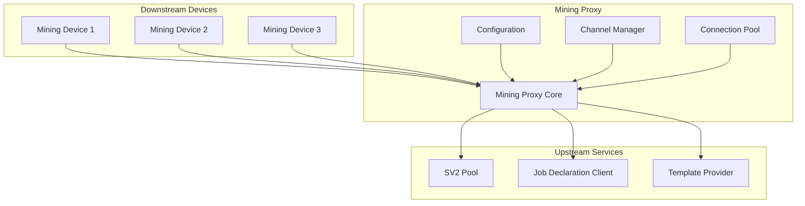
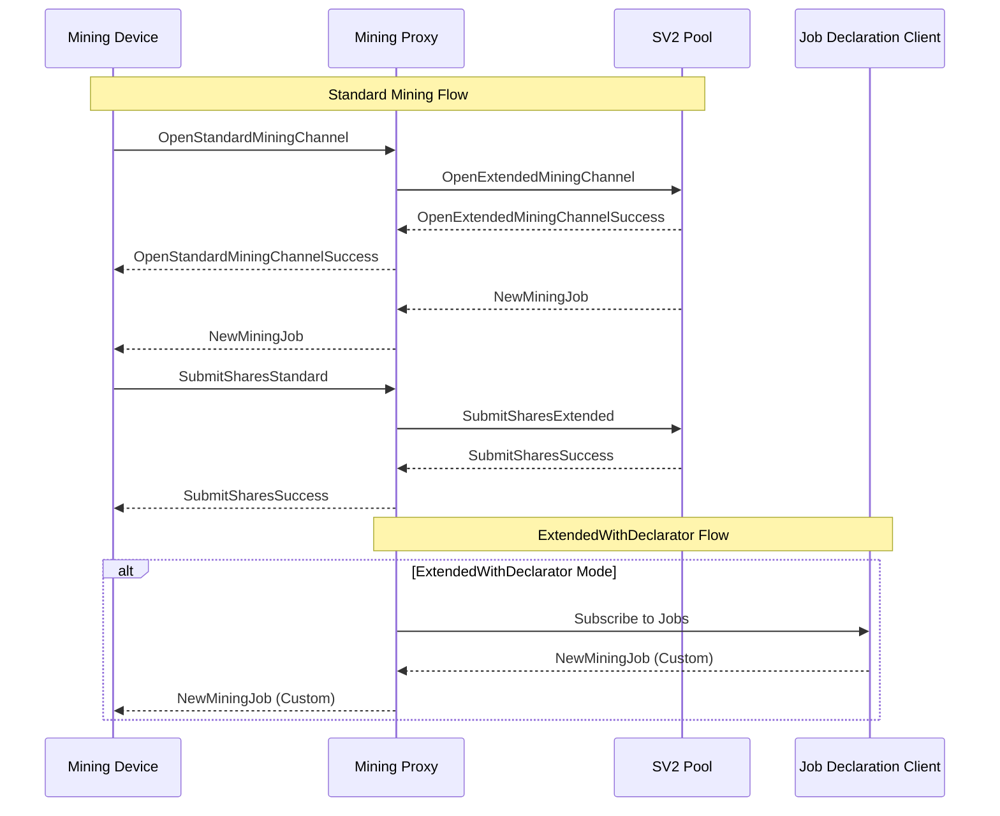
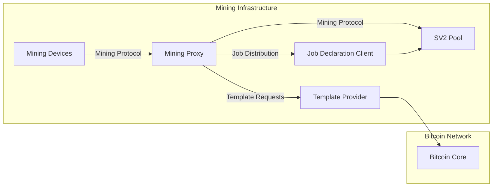
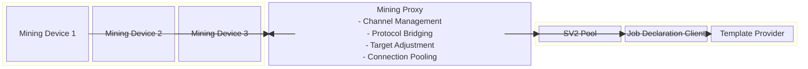

# Mining Proxy

The Mining Proxy is a crucial component in the Stratum V2 ecosystem that acts as an intermediary between mining devices and upstream mining infrastructure. It provides flexible channel management, protocol translation, and efficient connection pooling for mining operations.

## Overview

The Mining Proxy serves as a bridge between downstream mining devices and upstream pools or other mining infrastructure. It supports multiple channel types and can operate in various modes depending on the mining setup requirements, from simple relay operations to advanced job declaration scenarios.

## Architecture



## Features

- **Multiple Channel Types**: Supports Group, Extended, and ExtendedWithDeclarator channels
- **Connection Pooling**: Efficient management of upstream and downstream connections
- **Protocol Bridging**: Seamless integration between different Stratum V2 components
- **Flexible Configuration**: Highly configurable for various mining scenarios
- **Hash Rate Management**: Intelligent target adjustment based on downstream capabilities
- **Job Declaration Support**: Integration with Job Declaration Protocol when needed

## Channel Types

### Group Channels
- **Purpose**: Simple relay mode for standard mining operations
- **Behavior**: Relays standard channel requests from downstream to upstream
- **Use Case**: Traditional pool mining without extended features
- **HOM Support**: Non-HOM (Hash-On-Message) operation with channel grouping

### Extended Channels
- **Purpose**: Advanced mining with extended channel features
- **Behavior**: Opens extended channels with upstream, creates standard channels for downstream
- **Use Case**: Enhanced mining operations with better efficiency
- **Features**: Improved job distribution and share submission

### ExtendedWithDeclarator
- **Purpose**: Custom job selection with Template Provider integration
- **Behavior**: Connects to Template Provider and Job Declaration Client
- **Use Case**: Miners wanting control over transaction selection
- **Requirements**: Requires TP and JDC configuration

## Network Protocols and Ports

### Downstream Connections (Proxy as Server)
- **Protocol**: Stratum V2 Mining Protocol
- **Default Port**: Configurable via `listen_mining_port`
- **Listen Address**: Configurable via `listen_address`
- **Connection Type**: TCP with Noise Protocol encryption
- **Message Types**:
  - `OpenStandardMiningChannel`: Channel establishment
  - `SubmitSharesStandard`: Share submissions
  - `SetTarget`: Target difficulty updates

### Upstream Connections (Proxy as Client)

#### Pool Connections
- **Protocol**: Stratum V2 Mining Protocol
- **Port**: Configurable per upstream
- **Connection Type**: TCP with Noise Protocol encryption
- **Message Types**:
  - `OpenExtendedMiningChannel`: Extended channel requests
  - `NewMiningJob`: Job distribution
  - `SubmitSharesExtended`: Share submissions

#### Job Declaration Client (when using ExtendedWithDeclarator)
- **Protocol**: Stratum V2 Job Distribution Protocol
- **Port**: Configurable via `jd_values`
- **Connection Type**: TCP with Noise Protocol encryption

#### Template Provider (when using ExtendedWithDeclarator)
- **Protocol**: Stratum V2 Template Distribution Protocol
- **Port**: Configurable via `tp_address`
- **Connection Type**: TCP with optional encryption

## Message Flow



## Configuration

The Mining Proxy uses a TOML configuration file (`proxy-config.toml`) with the following structure:

### Upstream Configuration
```toml
[[upstreams]]
channel_kind = "Extended"  # Group | Extended | ExtendedWithDeclarator
address = "127.0.0.1"
port = 34254
pub_key = "upstream_public_key"

# Required only for ExtendedWithDeclarator
[upstreams.jd_values]
address = "127.0.0.1"
port = 34264
pub_key = "jd_public_key"
```

### Network Settings
- `listen_address`: Downstream connection listening address
- `listen_mining_port`: Port for downstream mining device connections
- `tp_address`: Template Provider address (for ExtendedWithDeclarator)

### Protocol Settings
- `max_supported_version`: Maximum Stratum V2 version (default: 2)
- `min_supported_version`: Minimum Stratum V2 version (default: 2)
- `downstream_share_per_minute`: Expected downstream share rate

## Setup and Usage

### Prerequisites
- Rust toolchain (see project MSRV requirements)
- Access to upstream mining infrastructure (Pool, JDC, TP as needed)
- Configuration file (`proxy-config.toml`)

### Configuration File Location
The proxy looks for `proxy-config.toml` in the current working directory by default. Use the `-c` option to specify a different path:

```bash
cargo run -- -c /path/to/custom-config.toml
```

### Running the Mining Proxy

```bash
cd roles/mining-proxy
cargo run
```

### Testing the Complete Stack

#### Terminal 1 - Start Pool
```bash
cd examples/sv2-proxy
cargo run --bin pool
```

#### Terminal 2 - Start Mining Proxy
```bash
cd roles/mining-proxy
cargo run
```

#### Terminal 3 - Start Mining Device
```bash
cd examples/sv2-proxy
cargo run --bin mining-device
```

## Role Interactions



### Upstream Dependencies
- **SV2 Pool**: Primary upstream for mining operations
  - **Protocol**: Stratum V2 Mining Protocol
  - **Authentication**: Noise Protocol with public key verification
- **Job Declaration Client**: For ExtendedWithDeclarator mode
  - **Protocol**: Job Distribution Protocol
  - **Port**: Configurable via `jd_values`
- **Template Provider**: For custom job selection
  - **Protocol**: Template Distribution Protocol
  - **Port**: Configurable via `tp_address`

### Downstream Clients
- **Mining Devices**: Connect for mining operations
  - **Protocol**: Stratum V2 Mining Protocol
  - **Port**: Configurable via `listen_mining_port`

## Block Diagram



## Target Calculation

The Mining Proxy automatically calculates appropriate difficulty targets for downstream devices based on:
- `downstream_share_per_minute`: Expected share submission rate
- Downstream hashrate (communicated via `OpenStandardMiningChannel`)
- Network difficulty and pool requirements

## Error Handling

- **Connection Failures**: Automatic reconnection with exponential backoff
- **Protocol Errors**: Graceful handling of malformed messages
- **Channel Management**: Proper cleanup of failed channels
- **Upstream Failures**: Failover mechanisms for multiple upstreams

## Security Considerations

- **Noise Protocol**: All connections use Noise Protocol encryption
- **Public Key Authentication**: Verification of upstream public keys
- **Input Validation**: Comprehensive validation of all protocol messages
- **Connection Limits**: Configurable limits on concurrent connections

## Performance Optimization

- **Connection Pooling**: Efficient reuse of upstream connections
- **Asynchronous Processing**: Non-blocking I/O for all operations
- **Memory Management**: Efficient buffer management for high-throughput scenarios
- **Share Aggregation**: Intelligent batching of share submissions

## Monitoring and Logging

- **Connection Status**: Real-time monitoring of all connections
- **Performance Metrics**: Hashrate, share rates, and latency tracking
- **Error Reporting**: Detailed logging of all error conditions
- **Health Checks**: Periodic validation of upstream connectivity

## Development

### Key Components
- **Channel Manager**: Handles different channel types and lifecycle
- **Connection Pool**: Manages upstream and downstream connections
- **Protocol Handler**: Processes Stratum V2 messages
- **Target Calculator**: Computes appropriate difficulty targets

## Limitations

- Configuration file required at startup
- Limited to Stratum 
