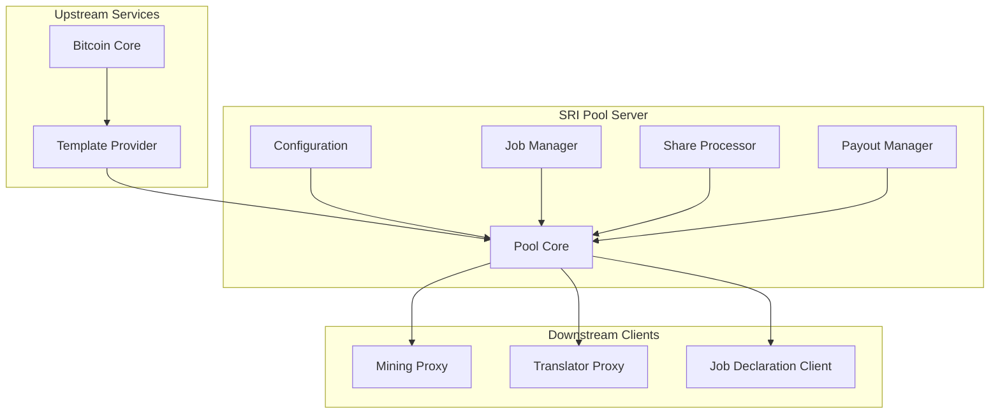
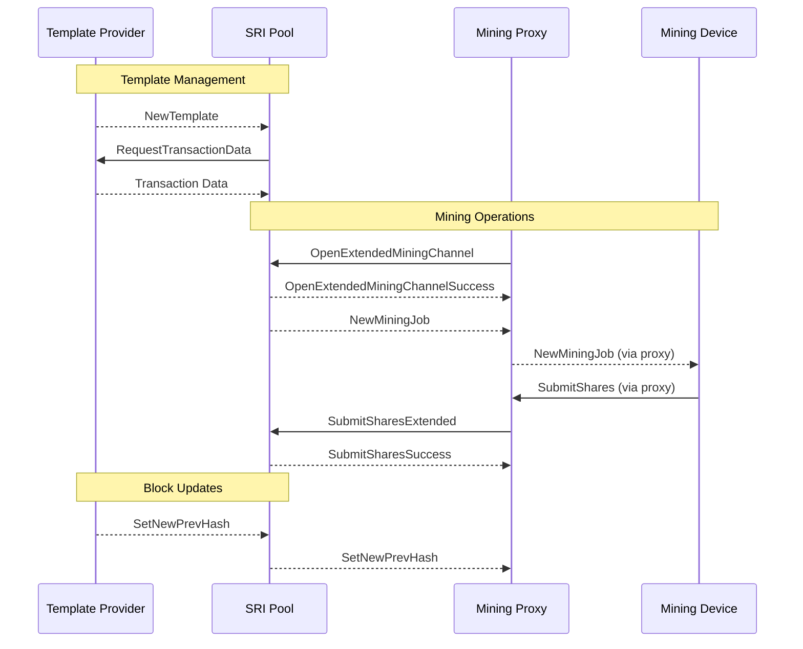
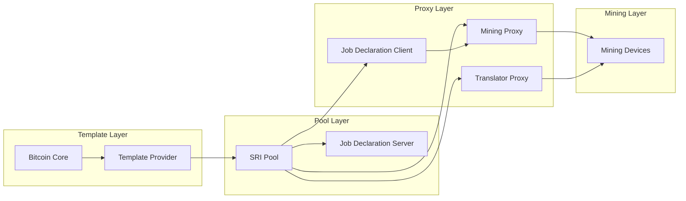
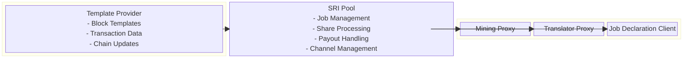
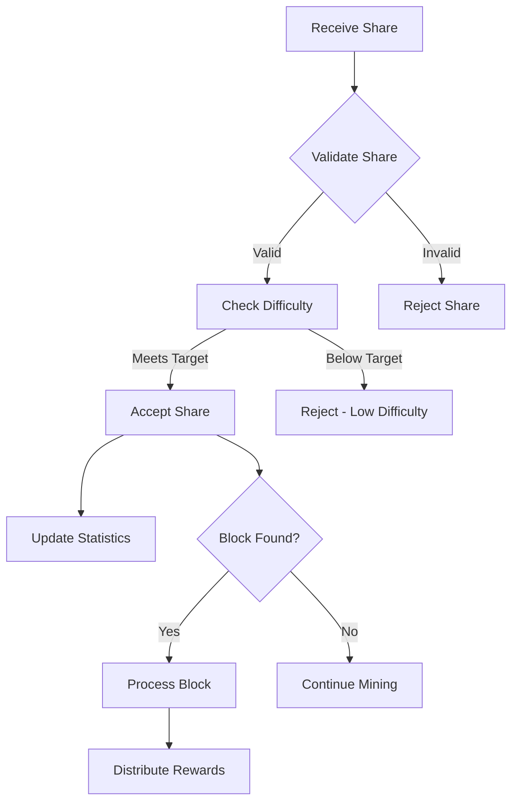

# SRI Pool

The SRI Pool is a comprehensive Stratum V2 pool server implementation designed to communicate with downstream roles using the SV2 protocol. It provides advanced mining pool functionality with support for extended channels, job declaration, and template distribution.

## Overview

SRI Pool serves as the central mining coordination point in a Stratum V2 mining infrastructure. It manages mining jobs, processes share submissions, handles payouts, and coordinates with Template Providers to ensure efficient and decentralized mining operations.

## Architecture



## Features

- **Stratum V2 Protocol**: Full support for SV2 mining protocol
- **Extended Channels**: Advanced channel management with extended features
- **Job Declaration Support**: Integration with Job Declaration Protocol
- **Template Integration**: Seamless connection to Template Providers
- **Flexible Payouts**: Configurable coinbase output management
- **Share Processing**: Efficient validation and processing of mining shares
- **Multi-Client Support**: Handles multiple downstream connections simultaneously

## Network Protocols and Ports

### Downstream Connections (Pool as Server)
- **Protocol**: Stratum V2 Mining Protocol
- **Default Port**: Configurable via `listen_address`
- **Connection Type**: TCP with Noise Protocol encryption
- **Message Types**:
  - `OpenStandardMiningChannel`: Standard channel establishment
  - `OpenExtendedMiningChannel`: Extended channel establishment
  - `SubmitSharesStandard`: Standard share submissions
  - `SubmitSharesExtended`: Extended share submissions
  - `NewMiningJob`: Job distribution to miners

### Upstream Connections (Pool as Client)

#### Template Provider Connection
- **Protocol**: Stratum V2 Template Distribution Protocol
- **Port**: Configurable via `tp_address`
- **Connection Type**: TCP with optional Noise Protocol encryption
- **Message Types**:
  - `NewTemplate`: Receives new block templates
  - `SetNewPrevHash`: Updates for new blocks
  - `RequestTransactionData`: Requests transaction details

## Message Flow



## Configuration

The SRI Pool uses TOML configuration files with the following key sections:

### Pool Authority Configuration
- `authority_public_key`: Pool's public key for client authentication
- `authority_secret_key`: Pool's private key for signing
- `cert_validity_sec`: Certificate validity duration

### Network Configuration
- `listen_address`: Address and port for downstream connections
- `tp_address`: Template Provider connection address
- `tp_authority_public_key`: TP's public key for verification (optional)

### Coinbase Configuration
- `coinbase_outputs`: List of payout destinations
- `pool_signature`: Signature string for coinbase transactions

Supported output types:
- **P2PK**: Pay-to-Public-Key
- **P2PKH**: Pay-to-Public-Key-Hash
- **P2WPKH**: Pay-to-Witness-Public-Key-Hash
- **P2SH**: Pay-to-Script-Hash
- **P2WSH**: Pay-to-Witness-Script-Hash
- **P2TR**: Pay-to-Taproot

## Setup and Usage

### Prerequisites
- Access to a Template Provider
- Rust toolchain (see project MSRV requirements)
- Valid coinbase output configuration

### Configuration Files
Two example configurations are provided:
- `pool-config-hosted-tp-example.toml`: Uses community-hosted Template Provider
- `pool-config-local-tp-example.toml`: Uses local Template Provider

### Running the Pool

```bash
cd roles/pool/config-examples
cargo run -- -c pool-config-hosted-tp-example.toml
```

### Template Provider Authentication
To verify Template Provider authenticity, obtain the TP's public key from its logs:
```
2024-02-13T14:59:24Z Template Provider authority key: EguTM8URcZDQVeEBsM4B5vg9weqEUnufA8pm85fG4bZd
```

## Role Interactions



### Upstream Dependencies
- **Template Provider**: Required for block templates
  - **Protocol**: Template Distribution Protocol
  - **Authentication**: Optional public key verification
  - **Features**: Custom transaction selection, template updates

### Downstream Clients
- **Mining Proxies**: Advanced SV2 mining clients
  - **Protocol**: Stratum V2 Mining Protocol
  - **Features**: Extended channels, job distribution
- **Translator Proxies**: SV1 to SV2 bridge clients
  - **Protocol**: Stratum V2 Mining Protocol
  - **Features**: SV1 compatibility, protocol translation
- **Job Declaration Clients**: Custom job selection clients
  - **Protocol**: Job Declaration Protocol
  - **Features**: Template declaration, custom mining

## Block Diagram



## Mining Job Management

The pool manages different types of mining jobs:

### Standard Jobs
- Generated from Template Provider templates
- Distributed to standard mining channels
- Fixed transaction sets

### Extended Jobs
- Enhanced job information for extended channels
- Optimized for advanced mining operations
- Better efficiency and reduced bandwidth

### Custom Jobs
- Jobs declared via Job Declaration Protocol
- Custom transaction selection by miners
- Enhanced decentralization

## Share Processing



## Payout System

- **Coinbase Outputs**: Configurable payout destinations
- **Multiple Output Types**: Support for various Bitcoin script types
- **Pool Signature**: Custom signature in coinbase transactions
- **Reward Distribution**: Automatic handling of mining rewards

## Security Considerations

- **Noise Protocol**: All client connections use Noise Protocol encryption
- **Public Key Authentication**: Secure client authentication
- **Template Verification**: Optional Template Provider authentication
- **Share Validation**: Comprehensive validation of all submitted shares
- **Input Sanitization**: Protection against malformed protocol messages

## Performance Optimization

- **Asynchronous Processing**: Non-blocking I/O for all operations
- **Connection Pooling**: Efficient management of client connections
- **Job Caching**: Intelligent caching of mining jobs
- **Share Batching**: Optimized processing of share submissions

## Monitoring and Logging

- **Real-time Metrics**: Pool hashrate, share rates, and client statistics
- **Connection Monitoring**: Status of all client connections
- **Template Status**: Template Provider connection health
- **Error Tracking**: Comprehensive logging of all error conditions

## Error Handling

- **Connection Failures**: Graceful handling of client disconnections
- **Protocol Errors**: Robust handling of malformed messages
- **Template Issues**: Fallback mechanisms for template problems
- **Share Validation**: Detailed error reporting for invalid shares

## Development

### Key Components
- **Pool Manager**: Central coordination of all pool operations
- **Job Manager**: Creation and distribution of mining jobs
- **Share Processor**: Validation and processing of submitted shares
- **Channel Manager**: Handling of different channel types
- **Template Handler**: Communication with Template Provider

### Configuration Management
- **TOML Parsing**: Robust configuration file processing
- **Validation**: Comprehensive validation of all configuration parameters
- **Hot Reload**: Support for configuration updates (future enhancement)

## Limitations

- Single Template Provider connection
- Limited to Stratum V2 protocol version
