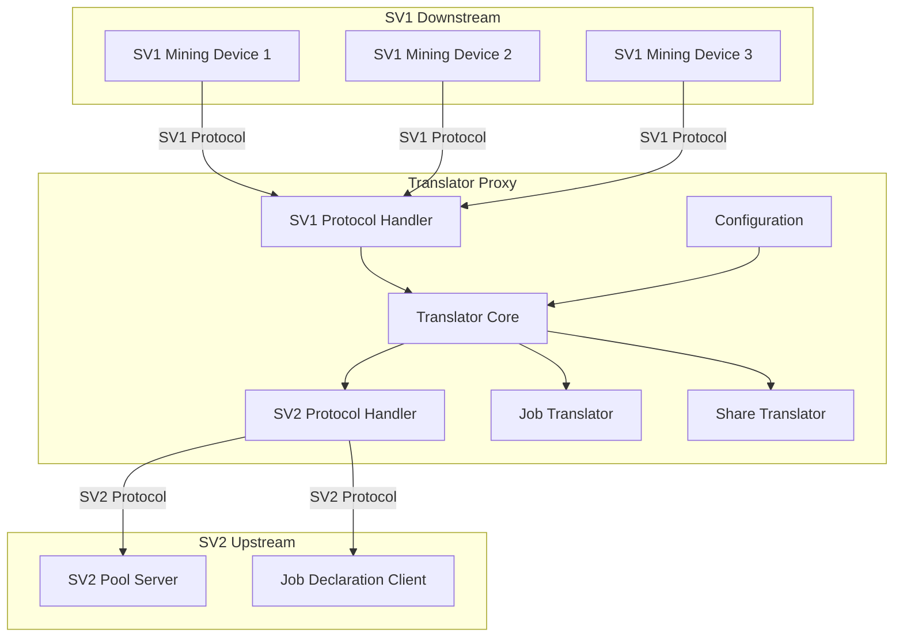
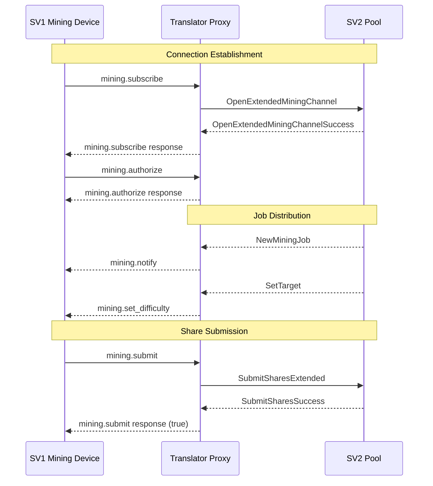
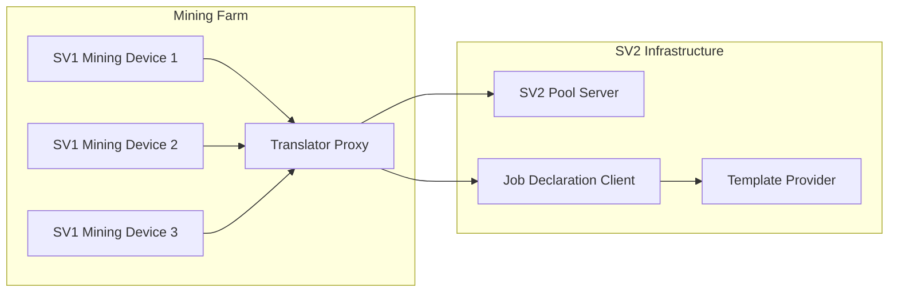
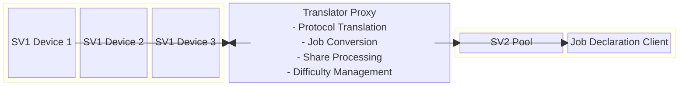
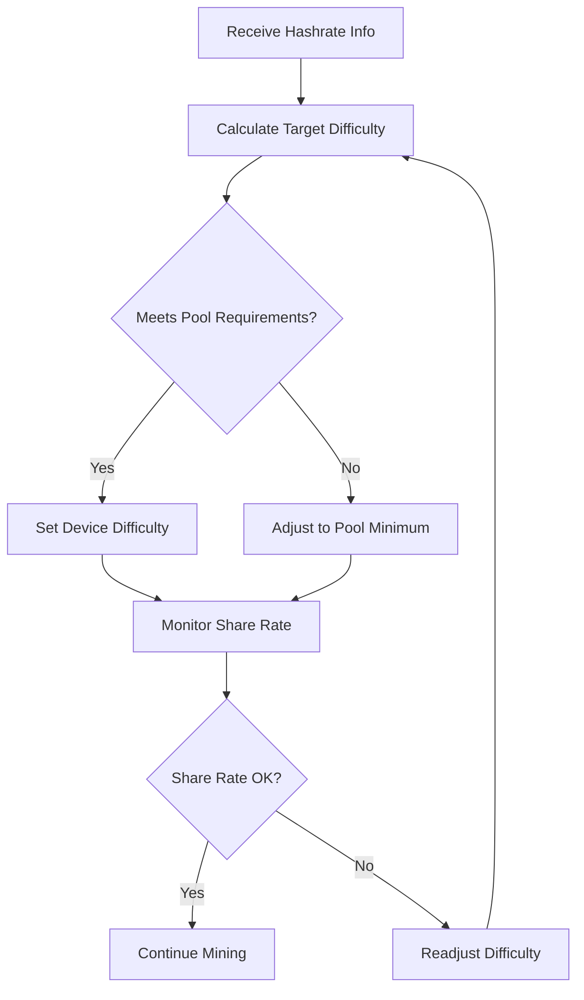

# SV1 to SV2 Translator Proxy

The SV1 to SV2 Translator Proxy is a critical bridge component that enables legacy SV1 mining devices to participate in modern Stratum V2 mining infrastructure. It provides seamless protocol translation while maintaining compatibility with existing mining hardware.

## Overview

This proxy sits between SV1 downstream mining devices and SV2 upstream infrastructure, translating between the two protocol versions. It enables mining farms with legacy equipment to benefit from Stratum V2 improvements without requiring firmware upgrades.

## Architecture



## Features

- **Protocol Translation**: Seamless conversion between SV1 and SV2 protocols
- **Legacy Device Support**: Enables SV1 devices to use SV2 infrastructure
- **Extended Channel Support**: Utilizes SV2 extended channels for efficiency
- **Job Declaration Integration**: Optional integration with Job Declaration Protocol
- **Difficulty Management**: Intelligent target adjustment for downstream devices
- **Connection Pooling**: Efficient management of multiple SV1 connections

## Network Protocols and Ports

### Downstream Connections (Translator as Server)
- **Protocol**: Stratum V1 (JSON-RPC over TCP)
- **Default Port**: Configurable via `downstream_port`
- **Listen Address**: Configurable via `downstream_address`
- **Connection Type**: Plain TCP (no encryption in SV1)
- **Message Types**:
  - `mining.subscribe`: Subscription to mining notifications
  - `mining.authorize`: Worker authorization
  - `mining.submit`: Share submission
  - `mining.notify`: Job notifications (server to client)
  - `mining.set_difficulty`: Difficulty updates (server to client)

### Upstream Connections (Translator as Client)

#### SV2 Pool Connection
- **Protocol**: Stratum V2 Mining Protocol
- **Port**: Configurable via `upstream_port`
- **Address**: Configurable via `upstream_address`
- **Connection Type**: TCP with Noise Protocol encryption
- **Authentication**: Public key verification via `upstream_authority_pubkey`
- **Message Types**:
  - `OpenExtendedMiningChannel`: Channel establishment
  - `NewMiningJob`: Job distribution
  - `SubmitSharesExtended`: Share submissions
  - `SetTarget`: Target difficulty updates

#### Job Declaration Client (Optional)
- **Protocol**: Stratum V2 Job Distribution Protocol
- **Connection**: When using Job Declaration setup
- **Features**: Custom job selection and distribution

## Message Flow



## Configuration

The Translator Proxy uses TOML configuration files with the following sections:

### SV2 Upstream Configuration
- `upstream_address`: SV2 pool server address
- `upstream_port`: SV2 pool server port
- `upstream_authority_pubkey`: Pool's public key for authentication
- `max_supported_version`: Maximum SV2 version (default: 2)
- `min_supported_version`: Minimum SV2 version (default: 2)

### SV1 Downstream Configuration
- `downstream_address`: Listening address for SV1 devices
- `downstream_port`: Listening port for SV1 devices
- `min_extranonce2_size`: Minimum extranonce2 size preference

### Difficulty Management
- `min_individual_miner_hashrate`: Hashrate of weakest mining device (H/s)
- `shares_per_minute`: Target share submission rate per device
- `channel_diff_update_interval`: Interval for hashrate updates (seconds)
- `channel_nominal_hashrate`: Estimated aggregate hashrate

## Setup and Usage

### Prerequisites
- Access to SV2 upstream infrastructure (Pool or JDC)
- SV1 mining devices
- Rust toolchain (see project MSRV requirements)

### Configuration Files
Two example configurations are provided:
- `tproxy-config-local-jdc-example.toml`: Uses Job Declaration Client
- `tproxy-config-local-pool-example.toml`: Direct pool connection

### Running the Translator

```bash
cd roles/translator/config-examples/
cargo run -- -c tproxy-config-local-jdc-example.toml
```

## Role Interactions



### Upstream Dependencies
- **SV2 Pool Server**: Primary upstream for mining operations
  - **Protocol**: Stratum V2 Mining Protocol
  - **Authentication**: Noise Protocol with public key verification
  - **Features**: Extended channels, efficient job distribution
- **Job Declaration Client**: Optional for custom job selection
  - **Protocol**: Job Distribution Protocol
  - **Features**: Custom transaction selection, enhanced decentralization

### Downstream Clients
- **SV1 Mining Devices**: Legacy mining hardware
  - **Protocol**: Stratum V1 (JSON-RPC)
  - **Features**: Standard SV1 mining operations
  - **Compatibility**: Works with existing firmware

## Block Diagram



## Protocol Translation

### SV1 to SV2 Translation
- **Job Notifications**: Converts SV2 `NewMiningJob` to SV1 `mining.notify`
- **Share Submissions**: Translates SV1 `mining.submit` to SV2 `SubmitSharesExtended`
- **Difficulty Updates**: Converts SV2 `SetTarget` to SV1 `mining.set_difficulty`
- **Subscription Management**: Handles SV1 subscription model with SV2 channels

### Data Format Conversion
- **Extranonce Handling**: Manages extranonce1/extranonce2 between protocols
- **Target Conversion**: Converts between SV1 difficulty and SV2 target formats
- **Job ID Mapping**: Maintains mapping between SV1 and SV2 job identifiers

## Difficulty Management

The translator implements intelligent difficulty adjustment:



### Difficulty Calculation Factors
- Individual miner hashrate
- Target shares per minute
- Pool difficulty requirements
- Network conditions

## Share Processing

### Share Validation
- **Format Validation**: Ensures SV1 share format compliance
- **Difficulty Check**: Validates share meets target difficulty
- **Duplicate Detection**: Prevents duplicate share submissions

### Share Aggregation
- **Batching**: Efficient batching of shares for SV2 submission
- **Timing Optimization**: Optimal submission timing for reduced latency

## Error Handling

- **Connection Failures**: Automatic reconnection with exponential backoff
- **Protocol Errors**: Graceful handling of malformed SV1 messages
- **Translation Errors**: Robust error handling during protocol conversion
- **Upstream Issues**: Proper error propagation to SV1 clients

## Security Considerations

- **SV1 Limitations**: SV1 protocol lacks encryption (inherent limitation)
- **SV2 Security**: Full Noise Protocol encryption for upstream connections
- **Input Validation**: Comprehensive validation of all SV1 inputs
- **Authentication**: Secure authentication with SV2 upstream

## Performance Optimization

- **Connection Pooling**: Efficient management of SV1 connections
- **Asynchronous Processing**: Non-blocking I/O for all operations
- **Memory Management**: Optimized buffer management for high throughput
- **Job Caching**: Intelligent caching of translated jobs

## Monitoring and Logging

- **Connection Status**: Real-time monitoring of all SV1 connections
- **Translation Metrics**: Statistics on protocol conversion operations
- **Performance Tracking**: Hashrate, share rates, and latency monitoring
- **Error Reporting**: Detailed logging of all error conditions

## Development

#